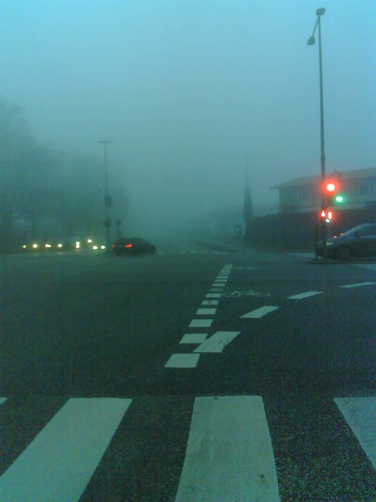
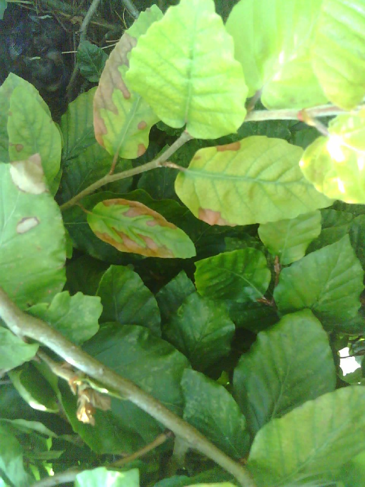

*What is an*

# AutCorder?

Ever thought about all the small but important aspects of daily life we tend to forget?
Have you been wanting to keep a diary but found it too difficcult to establish the routine?

AutCorders are small, minimal interaction-barrierer recording devices for taking low resolution pictures and recording short audio clips. The devices have been (and are being) designed to enable a daily practice of reflective data-capture with minimal intervention or interruption. So, instead of trying to keep a diary, keep an AutCorder around to take pictures or audio throughout the day, to collect memories of things that matter.

<!--
-->

<em>The AutCorders come in many different shapes and can be customized for individual needs and practices.</em>

Want to give it a try? Check out the [Discord server](https://discord.gg/MrbKCkYYD7) first, someone might have a spare. Otherwise, build instructions can be found [here](docs/AutCorder/Build/).

{}
- 
  *"Too bad for anyone with a mobility impairment..."*

- 
  *"I make a detour most days to see if Frede is about."*

- 
  *"I feel a certain pride in being able to transport bulky stuff on my bicycle."*

- 
  *"meow"*

{}

{}

- 
  *"No more hugs or cuddles."*

- 
  *"A friend in late night adventures."*

- 
  *"I love foggy days. It makes the world quieter, calm."*

- 
  *"Nestlings in the hedge. We try to be quiet aroud them."*

{}

# AutTools otherwise
AutTools are tools for the self: They're small appliances built solely to support our own particular and peculiar practices.  
Beyond the AutCorders, current AutTools include the [NeoInfinity interaction signalling badges](docs/NeoInfinity/) shaped like infinity symbols, and the in-development [flying checklist](docs/FlyingChecklist/), a cognitive aid built to ease the process of remembering things. 

Want to know more about the project, share your own toolkit or propose ideas for future AutTools? [Get in touch!](mailto:salroee@cc.au.dk?subject=AutTools)