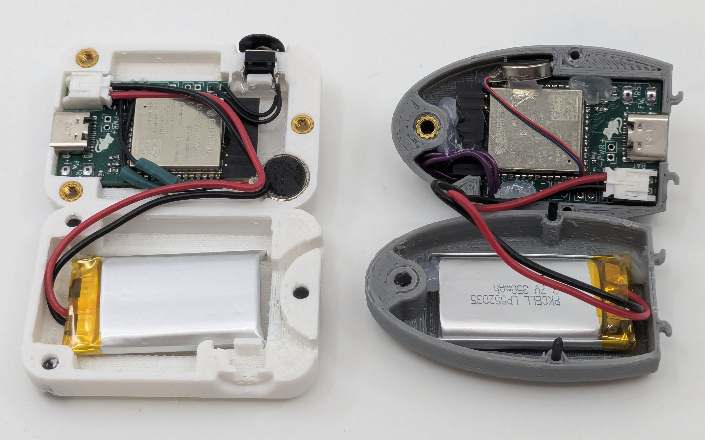
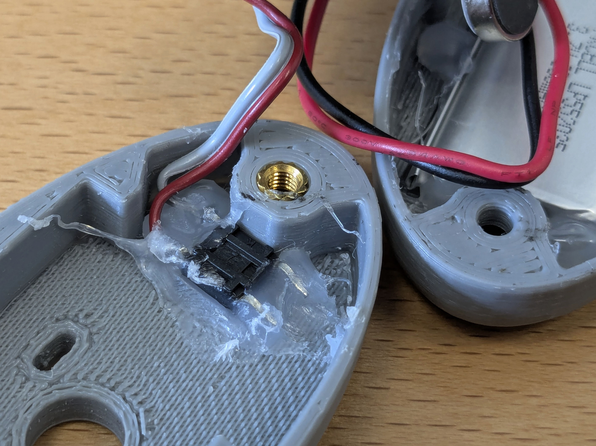

# Step 3: Assembling an AutCorder

Now to put it all together. This step will involve attaching the remaining components to the PCB and installing everything in the printed shell. Depending on the chosen shell, assembly will be somewhat different. For most assembly, hot glue is used, as any mistakes can easily be detached with a bit of isopropyl alcohol.

The goal is to end up with something along these lines:

## Requirements
- A shutter button.
	- For the SquareCam and PebbleCam a completely standard 6x6mm momentary button is used.
	- For the TrunkCam, a low-profile keyboard switch is used. The particular switch used in the photo above is a Kailh Choc V1 switch.
	- Suggested source: Your previously chosen electronics supplier.
- A(3V) vibration motor or piezo buzzer. 
	- The particular vibration motor used in these examples are Y98E1A40864.
	- Suggested source: AliExpress or similar import business. These can be found on places like Digi-Key as `Coin Vibration Motor` but at a much higher price.
- Camera module. 
	- The camera sensor used is the OV2640 with a 24 pin flat flex cable attached. Note that there are two or three different pinout variations available which are completely incompatible. The pinout used for the AutCorder is what currently appears to be the most common one (and is shared with the original M5Stack Unit Cam S3). If in doubt, compare the listed pinout with the board schematic below. As there is no established standard for from which end FFC pins are counted, the pinout may look reversed. Check the physical diagram to check order. Finally, note that OV5640 cameras of the (almost) same pinout should also be supported. See below in the "Customizing section".
	- Suggested source: AliExpress or similar import business. 
- Micro SD card. 
	- Suggested source: Local electronics retailer, cheapest from a reputable brand.
- Battery. 
	- For the SquareCam and PebbleCam, a 350mAh PKCELL LP552035 battery with JST-PH connector is used. Mind the polarity of the connector as some are reversed. This is easily fixed by pushing down the metal clip of each pin and pulling out the wires to reverse them. Be careful not to short the pins while out.
	- For the TrunkCam, a standard 18650 battery with a `BHC-18650-1P` battery holder is used, with wire and connector manually soldered.
	- Suggested source: Local electronics retailer, as international shipping of Li-Po batteries can be dodgy.

  
AutCorder OV2640 Pinout from the AutCorder Schematic

  

## Sub-Steps
### Installing the Camera and Micro SD card
If not already done, the SD card should be formatted as FAT32 (You can also use this opportunity to label the drive, as renaming may not be possible through the device). Simply slot the card into the socket on the PCB, pins towards the circuit.

For the camera, flip up the lever on the FFC connector, slide in the camera flex connector as far as it will go (again with pins towards the PCB), and close down the lever again. The camera should sit fixed perpendicular to the connector.

With these attached, the fit of the shell can be checked, to see if any adjustments need to be made. Likely the camera flat flex may need to be carefully folded in on itself to place the camera at the right distance to fit the lens slot of the shell. A piece of double sided tape can be used to fix the camera in place. If not, a piece of isolation tape should be used to stop the metal backplate of the camera sensor from shorting other components on the board.

### Installing the shutter button
Depending on the shell, the shutter button is mounted in quite different ways. Follow the relevant branch below:
#### PebbleCam shutter button
On the PebbleCam shell, the shutter button is mounted in front of the camera, between the shell and the board antenna. To fit, the buttons legs must be folded outwards flat. 
Cut a couple of wires to length, and them to solder to the button legs (if unsure, check with a multimeter which pins are permanently connected and which are switched). They should be able to reach outwards around the antenna and back to the shutter pins, and preferably be a bit longer to allow the board to be flipped out from the shell to adjust the SD card or camera later if necessary. The button is hot-glued in with the legs vertical. For good measure, place a bit of isolation tape over the button and solder joints to avoid any risk of shorting. With the fit checked again, the wires can be soldered into the shutter pins of the PCB.

#### SquareCam Shutter button
On the SquareCam, the shutter button is mounted at the top of the camera between the two shell halves in its socket. To keep the button in place, its legs can be folded around the platform beneath it. Cut a couple of wires to length, and solder to the button pins (if unsure, check with a multimeter which pins are permanently connected and which are switched). The wires do not need to be particularly long, as they should just reach down to the shutter pins on the PCB. With the fit checked, the wires can be soldered into the shutter pins of the PCB.

#### TrunkCam shutter button
Compared to the other shells, the TrunkCam has quite a bit more space for fitting in parts. For the shutter button, cut two pieces of wire at a few centimeters length, solder them to the switches legs, and glue the switch in place in either of the shell halves. Then solder the wires into the shutter pins of the PCB.

### Preparing the vibration motor
For each of the shells, the vibration motor is mounted slightly differently. In the PebbleCam, the motor is squeezed in between the bottom edge of the PCB and the shell. The SquareCam has a dedicated slot for the motor in the bottom right of the front shell. In the TrunkCam it is simply glued in somewhere in the open space behind the PCB. Depending on the source, the motor wires may be long enough to reach by themselves, or may need to be extended another cm with extra wire. With the fit checked, the motor wires can be soldered into the FB pins of the PCB.
### Finishing up the assembly
Now everything can be pushed into place, and affixed with hot glue as necessary. Finally the 3D printed button can be attached to the shutter button with a glob of hot glue.

Note: You should probably wait with closing up the AutCorder entirely before having flashed its software, as the process may involve keeping the FW button depressed while attaching power or hitting the RST button.
### Attaching the battery
With everything else attached, the li-po battery can finally be plugged in. Due to the limited space, the connector may need to be angled upwards slightly, the cable pressed against the plug, and the plug wiggled in carefully to not shear off the charge LED. Keep you eyes out for any magic smoke or things heating unreasonably due to an unfixed short somewhere on the board. Unplug the battery immediately if it happens.

Depending on the surface finish of the shell, it might make sense to cover the backside of the battery in a piece of tape to avoid risk of puncture.