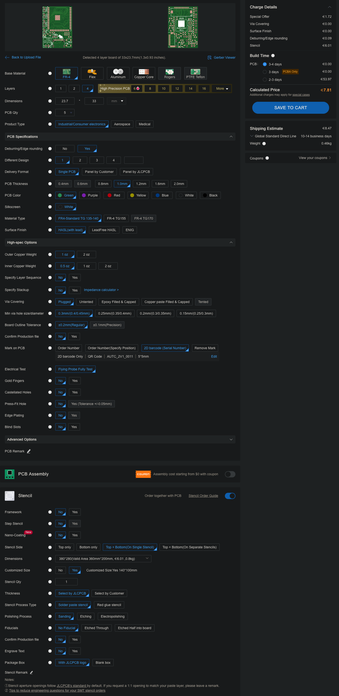
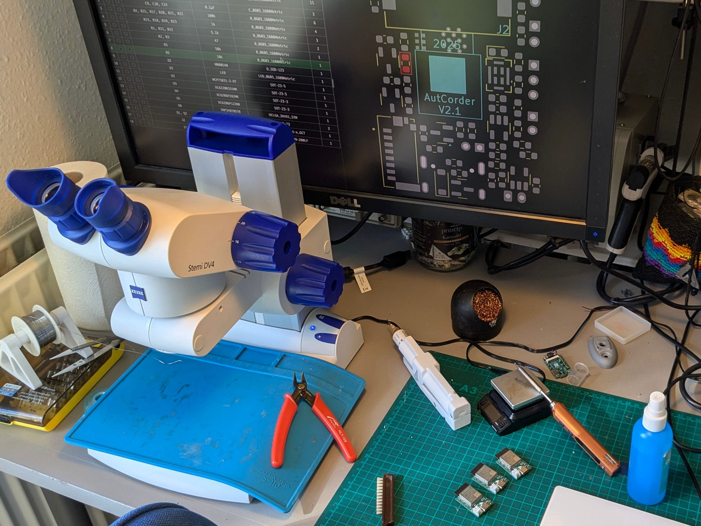
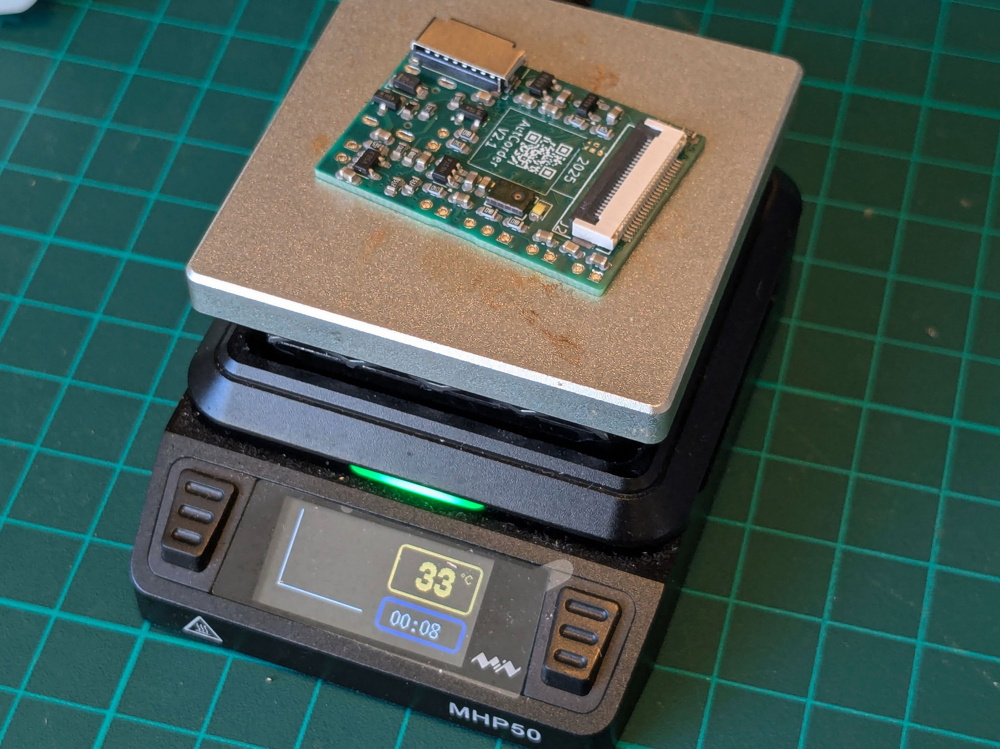
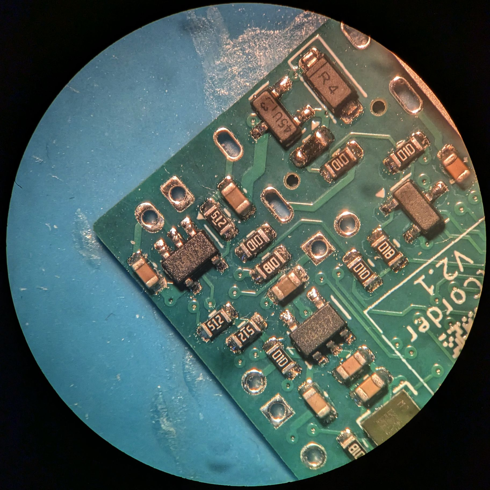

# Step 1: Assembling the base AutCorder PCB

To reduce complexity of production otherwise, most of the AutCorders functionality is managed on a relatively dense 4-layer PCB. Assembly should be doable by anyone with a bit of experience with SMD soldering and the necessary tools. The smallest parts on the PCB use the 0306 footprint.
## Requirements
The bill of materials for assembling the pcb is:
- The AutCorder PCB - See below.
- PCB Components:

| **Component**                     | **Specification**           | **Quantity** | **Suggested part**               | **Footprint**                           | **Schematic Reference**             |
|-----------------------------------|-----------------------------|--------------|----------------------------------|-----------------------------------------|-------------------------------------|
| Capacitor                         | 10 µF                       |           11 | CL10A106MQ8NNNC                  | 0603                                    | C1,C2,C3,C4,C5,C6,C7,C8,C11,C12,C13 |
| Capacitor                         | 0.1 µF                      |            3 | MT18B104K500CT                   | 0603                                    | C9,C10,C14                          |
| Charge LED                        | LED                         |            1 | B1911UY--20D000114U1930          | 0603                                    | D1                                  |
| Flash LED                         | LED                         |            1 | LW Q98G.01-R2T1-3K6L-1-5-R18     | 0603                                    | D3                                  |
| Schottkey Diode                   | MBR0540                     |            1 | MBR0540CT                        | D_SOD-123                               | D2                                  |
| Battery connector                 | S2B-PH-K-S                  |            1 | S2B-PH-K-S                       | JST_PH_S2B-PH-K_1x02_P2.00mm_Horizontal | J1                                  |
| Camera FFC Connector              | FFC2B35-24-G                |            1 | CF35242D0RD-NH                   | CF35242D0RD-NH                          | J2                                  |
| Micro SD card socket              | AMPHENOL_10067099-200LF     |            1 | 10067099-200LF                   | AMPHENOL_10067099-200LF                 | J7                                  |
| USB-C Plug                        | USB_C_Receptacle_USB2.0_16P |            1 | USB4105-GF-A                     |                                         | P1                                  |
| P-Channel Enhancement Mode MOSFET | DMP2045U                    |            2 | DMP2045U-7                       | SOT-23                                  | Q1,Q2                               |
| N-Channel Enhancement Mode MOSFET | DMN2040U                    |            1 | DMN2040U-13                      | SOT-23                                  | Q3                                  |
| Resistor                          | 5.1kΩ                       |            3 | (Whatever's cheap at the moment) | 0603                                    | R1,R11,R12                          |
| Resistor                          | 47Ω                         |            2 | -                                | 0603                                    | R2,R3                               |
| Resistor                          | 100kΩ                       |            6 | -                                | 0603                                    | R4,R15,R17,R20,R21,R22              |
| Resistor                          | 50kΩ                        |            1 | -                                | 0603                                    | R5                                  |
| Resistor                          | 10kΩ                        |            5 | -                                | 0603                                    | R6,R7,R8,R9,R16                     |
| Resistor                          | 1kΩ                         |            5 | -                                | 0603                                    | R13,R14,R18,R19,R23                 |
| System Momentary Button           | EVP-6AWD40                  |            1 | EVP-6AWD40                       | EVP-6A                                  | SW1, SW2                            |
| MCU Board                         | ESP32-S3-WROOM-1            |            1 | ESP32-S3-WROOM-1-N16R8           | -                                       | U1                                  |
| Battery charge controller         | MCP73831-2-OT               |            1 | MCP73831T-2ACI/OT                | SOT-23-5                                | U2                                  |
| 3.3V Voltage Regulator            | XC6220B331MR                |            1 | XC6220B331MR-G                   | SOT-23-5                                | U3                                  |
| 2.8V Voltage Regulator            | XC6206P282MR                |            1 | XC6206P282MR                     | SOT-23-5                                | U4                                  |
| 1.2V Voltage Regulator            | XC6206P122MR                |            1 | XC6206P122MR-G                   | SOT-23-5                                | U5                                  |
| PDM Microphone                    | IMP34DT05TR                 |            1 | IMP34DT05TR                      | HCLGA_3X4X1_STM                         | U6                                  |

Note: These can also be found in the online [Interactive BOM](http://htmlpreview.github.io/?https://github.com/SarahAlroe/AutCorder-Hardware/blob/main/bom/ibom.html).

To do the assembly, the following tools and consumables are required:
- An SMT stencil for the board (technically optional but difficult without).
- A setup for SMD soldering: 
	- Solder paste (most types and qualities should work).
	- A hot plate or reflow oven.
	- (Completely) Optional: A soldering heat gun for reflowing.
	- Optional (but recommended): A low-magnification microscope. This is super useful for placing components, manual soldering, and inspection and correction of solder joints without hurting your neck.
- Tools for regular soldering:
	- Solder wire.
	- Soldering iron (fine tipped).
	- Optional (but recommended): Extra flux.

### Acquiring parts
Small production runs of multi-layer PCBs are readily available from online PCB prototyping services. The AutCorder PCB has been designed to follow most common design rules, and should be producible by any reputable prototyping service. Production has been confirmed successful with JLCPCB specifically. As PCBs are usually produced in multiples of 5, consider scaling the project along these lines. For much easier assembly, you should order a stencil from the service at the same time (if you do not have the tooling to produce one yourself).

To order from a prototyping service, usually the first step is to submit a zip of relevant production files for analysis and cost estimation. A pre-packaged zip of the board is available on GitHub [here](https://github.com/SarahAlroe/AutCorder-Hardware/blob/main/production/AutCorder-Hardware.zip). After analysis, additional order options can be specified. Default values should be fine, do check:
- Recommended PCB Thickness (for fitting the pre-designed shells) is 1mm.
- Via Covering should be set to "plugged".
- While optional, for JLCPCB, the boards have been prepared for setting the "Mark on PCB" option to "2D barcode", "5\*5mm", "Specify position" - for printing an enumerated QR code beneath the camera module.

While ordering the PCBs, there should be an option for adding a stencil to the order. I would recommend the following options:
- Having both top and bottom layout on a single stencil.
- Selecting a customized size of about 140\*100mm (if you do not have tooling for a specific size), as it's simply more manageable than a full size stencil for such a small PCB. 

  
Example JLCPCB Order:

  

For the PCB components, almost all can be ordered together from Digi-Key (Although some components, like the ESP32-S3 modules may be found cheaper elsewhere). At scale, this should qualify for free shipping. Do check if any components or tools from the following steps may also be ordered from here at the same time. 

## Sub-Steps
There are many ways to do SMD soldering. To minimize the effort and tools required, all the most complex and inaccessible footprints have been kept on the bottom-side of the PCB. My suggestion for approaching the task is as follows: 
1. Apply solder paste to the bottom-side of the board using a stencil
2. Manually place the components using tweezers.
3. Reflow the components using a hot plate.
4. Manually place and solder the topside components sequentially using a regular soldering iron.
5. Manually solder the few through-hole connections on the board.

### Applying solder paste to the bottom-side
For best results, the stencil should be placed as accurately as possible above the PCB solder pads. Doing this by eye is usually sufficient. To help this process, using the production files from the stencil, a simple jig can be 3d printed to hold the stencil, and a pcb in place beneath it. 
If using such a jig, put the stencil into it, tape it down, put in a PCB on the underside, align it, and then tape it down. Some adjustments may need to be made to the jig through cutting to get it to fit perfectly.
If not using the jig, other unpopulated PCBs (of the same thickness) can be placed on the table around the PCB-to-be-pasted, to support the stencil.

There are many guides online for how to properly apply paste w.r.t. temperature of the paste, pre-treatment etc. As the footprints here are relatively large, this should not matter too much. Scoop out a (larger than necessary) portion of paste and place it on the stencil along one of the edges of the pcb. Using a paint scraper or plastic card, spread the paste across the stencil, to fill out its cutouts. Make sure the stencil is not lifted from the PCB during this process, and avoid pushing the paste forcefully through the stencil, as too much paste may squeeze through to the PCB, making for solder bridges and a lot of cleanup later. Scrape off any paste remaining on top of the stencil with the card or scraper oriented more vertically, and put it back in the paste tub. Carefully remove the PCB and inspect. If the results are unsatisfactory, the paste can always be scraped off, and the board wiped down with isopropyl alcohol before trying again.

A rather imperfect solder paste application with components placed:

This will reflow just fine.
### Placing components on the board
Using a pair of tweezers, place the board components in their appropriate spot. Do not worry about small imprecisions in position or orientation, as these will be corrected in the reflow process as surface tension will pull the pads central. To ease the effort, use the online [interactive BOM](http://htmlpreview.github.io/?https://github.com/SarahAlroe/AutCorder-Hardware/blob/main/bom/ibom.html) to locate component positions and keep track of progress, and use a microscope if available. I would recommend starting with placing the smallest, low-profile components first (like the resistors and LEDs), to avoid creating obstructions for yourself.
Adhesion and surface tension is quite forceful at these scales, so keep some paper towel a solvent around to wipe down the tweezers if they contact the solder paste.
Be mindful that the orientation indicators for SMD LEDs may be [somewhat unintuitive and not entirely standardized](https://electronics.stackexchange.com/questions/141438/smd-led-polarity-marking-is-the-cathode-marking-standardized).

Working with a microscope and the interactive BOM:

### Reflowing the components onto the PCB
Carefully move the populated pcb onto the hot plate or into the reflow oven. If you know your tweezers well, these could be useful here, as moving it with your (squishy) fingers risks nudging some of the outermost components. 
If your oven or hot plate has the option for setting a profile, just follow the one recommended by the solder paste manufacturer. Make sure you have proper ventilation for this step!
Depending on your reflow systems ability to cool, you may want to move the PCB away from the heat source at the end of the reflow program to hurry the cooling process.

After reflowing (and depending on the success of the paste application), it's likely that the reflow process has produced a few solder bridges or unconnected pads. These are easily fixed with a visual inspection (again, a microscope helps), some solder flux, and a fine-tipped soldering iron.

### Soldering the top-side components on the PCB
The number (and footprint complexity) of components on the top-side of the PCB has been deliberately lowered as much as possible to enable soldering in different ways. While pasting, placing and (selective) reflowing using a heat gun is possible, i found it quicker and easier to simply manually solder the components, especially under a microscope. In sequence, 
- Apply some solder flux to the pads of a footprint.
- Place the component on the pads.
- Solder one of the pads manually, letting it flow out of correct position.
- Using the tweezers, move the component back into position while heating the solder joint. Let the solder joint cool down, and then let go of the component.
- Solder the remaining pads.
Here I again recommend starting with the smallest components, and finishing with the largest, to avoid constricting tweezer and iron movement for as long as possible. The ESP32-S3 board should be last.  

Due to its bulk and the very fine pitch of its pins, the USB-C connector is by far the most difficult component to solder on the top-side. To make it easier, consider starting with it and using plenty of solder flux. A simple approach that has worked for me (without microscope assistance), is flowing too much solder onto the pins, to ensure all have been soldered down, removing the excess with solder braid, cleaning the iron, applying extra flux, and then carefully reflowing any bridges, which should retract to their now under-flowed pads.

Before continuing, do another visual inspection for bad solder joints.
### Soldering through-hole components
Finally, the battery connector can be mounted and soldered on the underside, along the structural pins of the USB-C connector. 

Congratulations, you've assembled an AutCorder PCB.

