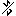
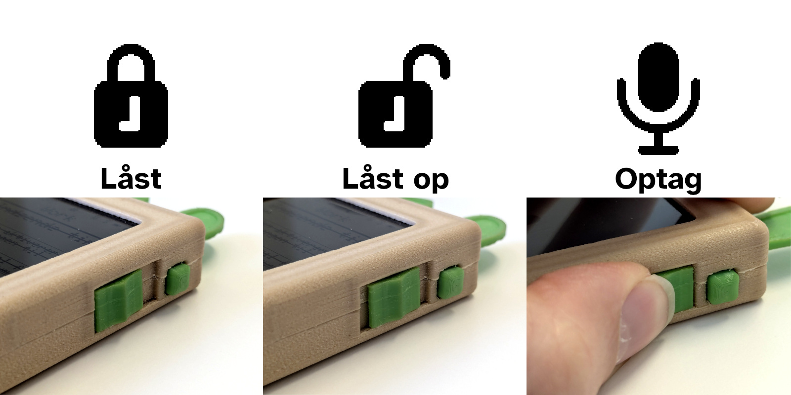
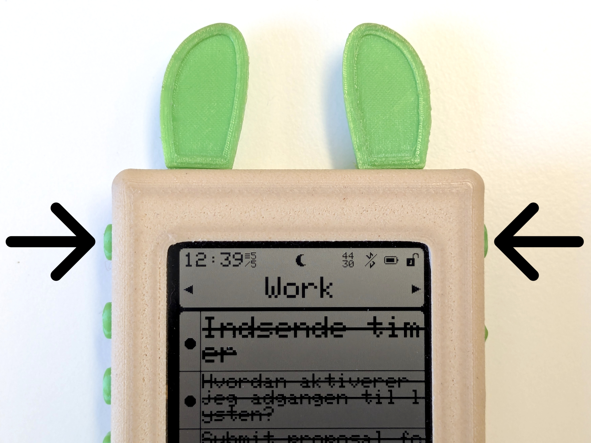

# Sådan bruges huskelisten
Denne side er en omfattende vejledning til hvordan en huskeliste fungerer.

## Interfacet på en huskeliste
Overordnet understøtter huskelisten tre forskellige former for interaktioner: At skifte mellem huskeliste sider, at optage nye noter til listen, og at navigere gennem og strege noter ud på listen. Denne side giver en detaljeret beskrivelse af hvordan alle disse ting fungerer.

### Hvordan huskelisten konceptualiseres
Huskelisten kan ses som en kombination af en regulær notesbog og en diktafon. Huskelisten har en eller flere sider, man kan bladre mellem, som er dedikeret til forskellige formål, så som husarbejde, hobbyer, eller indkøb. Hver side indeholder en række noter om ting man skal huske eller gøre i fremtiden. Når opgaven er blevet løst kan noten streges ud. Udstregede noter bliver så flyttet af vejen så der fortsat er overblik over ting som skal gøres. Man tilføjer nye noter til en side ved at optage stemmebeskeder med huskelisten. Disse optagelser bliver så løbende transkriberet og tilføjet til den givne huskeliste-side. 

### Skærmens indhold

For det meste er huskelistens skærm inddelt i syv dele. Den øverste del bruges til at vise huskelistens tilstand, mens de resterende seks felter viser noter fra den aktive huskeliste-side. Den øverste del består af en informations-bar øverst (ligesom man kunne finde på en smartphone), og under det navnet på den huskelisteside som er aktiv. Informations-baren viser et antal forskellige ikoner som forklarer hvad der aktivt sker på huskelisten:

I midten af baren bliver enten vist en måne  eller en sol . Dette indikerer om huskelisten for øjeblikket "sover" eller "er vågen", hvilket påvirker dens strømforbrug. Almindeligvis betyder denne forskel ikke synderligt da huskelisten vågner hurtigt. Huskelisten bør generelt kun være vågen under interaktion eller mens den transkriberer noter.

Fra højre betyder ikonerne følgende:
- Hængelås ikonet / indikerer om huskelisten er låst eller ej. Hvis den er låst har det ingen effekt at trykke på dens knapper, så man undgår aktivitet i lommen. Afsnittet under forklarer dette yderligere.
- Batteri-ikonet / indikerer hvor meget batteri der er tilbage på huskelisten. Når batteriet er tomt er det ved at være tid til at lade huskelisten op igen.
- Hvis huskelisten er sat op med WiFi viser WiFi ikonet  om huskelisten for øjeblikket er forbundet eller ej ved at være streget ud . WiFi forbindelser oprettes generelt kun når en optagelse skal transkriberes.
- Hvis huskelisten i stedet er sat op med Bluetooth, viser Bluetooth ikonet / tilsvarende om bluetooth er slukket, forsøger at forbinde, eller aktivt er forbundet til en smartphone.
- Hvis det er slået til i konfigurationen viser barren endeligt de fire sidste ciffre i huskelistens MAC adresse. Dette er generelt kun nyttigt til debugging formål.

Fra venstre side betyder ikonerne:
- Hvis slået til i konfigurationen vises et digital-ur. Bemærk dog afhængig af konfiguration at uret kan være bagud hvis huskelisten 'sover'.
- Hvis slået til vises antallet af noter på siden, og hvor mange af dem er streget ud.
- Hvis en optagelse venter på at blive transkriberet vises et timeglas . Hvis flere optagelser venter, vises antallet ud for timeglasset
- Hvis huskelisten aktivt laver noget i baggrunden (så som at transkribere noter) vises endeligt et lille tandhjul .
### Huskelistens inputs
Huskelisten har 8 knapper on en skydekontakt med tre positioner:

Når huskelisten opbevares i en lomme, eller på en anden måde hvor knapperne risikerer at blive trykket ved et uheld, kan huskelisten låses ved at skubbe skydekontakten til den nederste position. Når huskelisten er låst, virker knapperne ikke. I skydekontaktens midterste position er huskelisten låst op, og knapperne kan bruges. Ved at skubbe skydekontakten op i den øverste position optages en ny lydnote. Den øverste position er fjerdret, så så snart kontakten slippes falder den tilbage til den midterste position og afslutter optagelsen. Når optagelsen er afsluttet bliver den gemt til huskelistens interne hukommelse og vil lejlighedsvist blive transkriberet, hvorefter noten tilføjes til huskelisten.

De øverste to knapper på hver side af huskelisten bruges til at bladre mellem dens sider:

Ved at trykke på en af knapperne bladres en side i knappens retning. Hvis man bladrer forbi huskelistens sidste side vender man tilbage til den første og omvendt. Hvis huskelisten kun er konfigureret til at have en side har knapperne ingen funktion.

De seks resterende knapper på venstre side af huskelisten bruges med noterne på siden:

Hver knap svarer til et af felterne på skærmen, og symbolet der vises i venstre side af noten angiver hvad der sker ved tryk på den tilsvarende knap. En fyldt eller tom cirkel indikerer at noten vil blive streget ud (eller udstregningen fjernet) ved at holde knappen nede. Efter en tid bliver udstregede noter flyttet væk for at give plads til flere u-udstregede noter. Hvis en note har været udstreget i længere tid vil den blive slettet helt. Denne funktionalitet kan indstilles for hver notes-side. Hvis der trykkes kort på en knap vil den tilsvarende note i stedet åbnes i 'fuld skærm' så hele noten kan læses. Et tryk på en vilkårlig knap lukker noten ned igen. Hvis der er mere end seks noter på en side ændrer det øverste og/eller nederste ikon sig til en pil. Når man trykker på den tilsvarende knap scrolles der i stedet op eller ned på siden. Man her holde knappen nede for at blive ved med at scrolle.f

## Genopladning og USB forbindelse
Hvis huskelisten løber fuldkommen tør for strøm går skærmen ud. Bare rolig, noter og optagelser er gemt sikkert i hukommelsen. For at lade huskelisten op igen skal den blot sluttes til en lader eller computer med et USB-C kabel. Mens huskelisten lader op lyser en orange LED ved USB porten. Når lyset går ud er huskelisten fuldt opladet. Forvent at en fuld opladning kan tage et par timer, men opladningen kan selvfølgelig stoppes tidligere uden problem. Hvis du slutter huskelisten til en computer med et USB datakabel bør den vise sig i computerens fil-browser ligesom en lille usb-nøgle. Gennem filerne på disken kan huskelisten omkonfigureres. Se siden '[Konfigurer huskelisten](../Configure/)' for mere information. Mens huskelisten er koblet til strøm eller computer viser den et USB logo i fuld skærm. Når den bliver afkoblet genstarter huskelisten og vender tilbage til almindelig funktion.

## Tilbagevendende opgaver
Huskelisten har indbygget funktionalitet for at have automatisk tilbagevendende noter på et dagligt, ugentligt eller månedligt basis. Mere information om hvordan dette indstilles kan findes på følgende side: [Cron systemet](../Configure/Cron/)
## Yderligere funktionalitet
Ud over skærmen og knappen kan huskelisten, afhængig af produktion have en LED eller vibrations-motor til notifikationer, en LED til at vise opladning, og potentielt en højttaler, som alle kan indstilles på forskellige måder. Se siden '[Konfigurer huskelisten](../Configure/)' for mere information.

## Den hemmelige debug-menu
Advarsel: Debug menuen kan bruges til at fjerne alt fra huskelisten, så vær forsigtig.
Hvis huskelisten er låst, 'sover', begge side-skifte knapper er holdt inde, og der så sættes strøm til usb porten åbnes en debug menu. I denne menu kan man finde indstillinger til at genstarte, nulstille, og opdatere huskelisten over WiFi eller fra en fil. 
