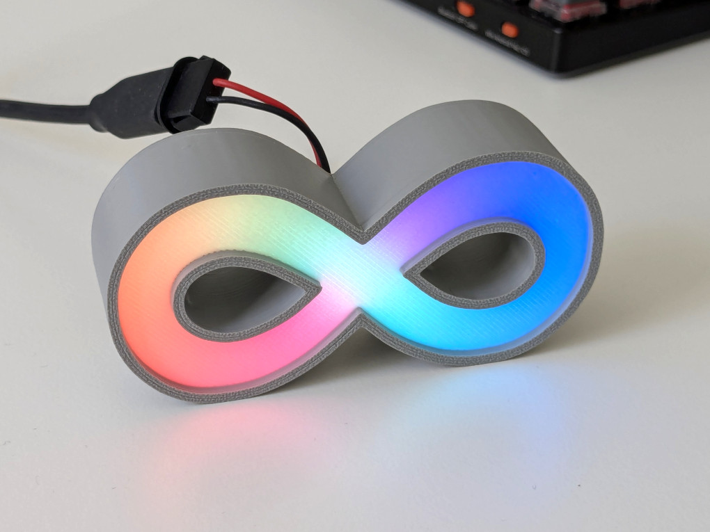

# Printing a diffuser case

{}
Note that printing a case is entirely optional. As long as the contacts of the board are not shorted, the PCB can be used as is.
{}

If you want to display the badge in a static location, Nicolas Mattia has designed a 3D-printable case with inbuilt diffuser, which looks very nice.

To build one, files and instructions can be found here: https://www.printables.com/model/1697559-neoinf-case-with-diffuser-neopixel-led-sign
Do look through the instructions first - the case print needs to be paused at a specific point to embed the diffuser!