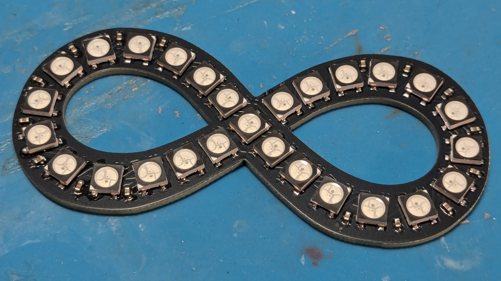

# Step 1: Assembling the badge PCB

While all parts of the badge are entirely hand-solderable, it's significantly faster to reflow solder at least part of it. If using a hot plate, reflow the LED side, and manually solder the back. Assembly should be doable by anyone with a bit of experience with SMD soldering and the necessary tools. The smallest parts on the PCB use the 0306 footprint.

Required parts:
- 1 x NeoInfinity PCB.
- 27 x WS2812B 5x5mm Addressable RGB LEDs.
- 1 x ATtiny412 SOIC package.
- 1 x EVQP2 push button.
- 1 x JST PH SMD connector (JST_S2B-PH-SM4-TB).
- 1 x 3 pin SMD 2.54mm socket (for programming, can be left out if not regularly reprogramming, instead just temporarily soldering programming pins to the socket pads).
- 17 x 100nF 0603 capacitors. (Note: Most if not all caps on the LED side can probably be skipped without issue, but will break spec.)
- 1 x 10µF 0603 capacitor.

{}
Note: The BOM can also be found in the online [Interactive BOM](https://htmlpreview.github.io/?https://github.com/SarahAlroe/NeoInfinity/blob/main/bom/ibom.html).
{}

To do the assembly, the following tools and consumables are required:
- Tools for regular hand soldering:
  - Solder wire.
  - Soldering iron (fine tipped).
  - Extra flux.
- If doing (partial) reflow soldering: 
  - An SMT stencil for the board.
  - Solder paste (most types and qualities should work).
  - A hot plate or reflow oven.
- Optional (but recommended): A low-magnification microscope. This is super useful for placing components, manual soldering, and inspection and correction of solder joints without hurting your neck.

### Acquiring parts
Small production runs of multi-layer PCBs are readily available from online PCB prototyping services. The AutCorder PCB has been designed to follow most common design rules, and should be producible by any reputable prototyping service. Production has been confirmed successful with JLCPCB specifically. As PCBs are usually produced in multiples of 5, consider scaling the project along these lines. For much easier assembly, you should order a stencil from the service at the same time (if you do not have the tooling to produce one yourself).

To order from a prototyping service, usually the first step is to submit a zip of relevant production files for analysis and cost estimation. A pre-packaged zip of the board is available on GitHub [here](https://github.com/SarahAlroe/NeoInfinity/blob/main/production/NeoInfinity.zip) (or [here](https://github.com/SarahAlroe/NeoInfinity/blob/main/production/NeoInfinity_w.zip) for a version without space for a production QR code on the back). After analysis, additional order options can be specified. Default values should be fine. While optional, for JLCPCB, the boards have been prepared for setting the "Mark on PCB" option to "2D barcode", "8\*8mm", "Specify position" - for printing an enumerated QR code on the back of the badge.

While ordering the PCBs, there should be an option for adding a stencil to the order. I would recommend the following options:
- Having both top and bottom layout on a single stencil (for good measure, even if only using the top layer stencil).
- Selecting a customized size of about 140\*100mm (if you do not have tooling for a specific size), as it's simply more manageable than a full size stencil for such a small PCB. 

For the PCB components, all can be ordered together from Digi-Key (Although some components, like the WS2812B LEDs can be bought significantly cheaper elsewhere (such as on AliExpress)). At scale, this should qualify for free shipping.

## Sub-Steps
There are many ways to solder the PCB. My suggestion for approaching the task is as follows: 
1. Apply solder paste to the top-side (LED side) of the board using a stencil
2. Manually place the components using tweezers.
3. Reflow the components using a hot plate.
4. Manually place and solder the bottom side components sequentially using a regular soldering iron.

Additional visual examples of the soldering process can be found in the AutCorder build instructions.

### Applying solder paste to the top-side
For best results, the stencil should be placed as accurately as possible above the PCB solder pads. Doing this by eye is usually sufficient. To help this process, using the production files from the stencil, a simple jig can be 3d printed to hold the stencil, and a PCB in place beneath it. 3D files for this can be found in the [Extras](https://github.com/SarahAlroe/NeoInfinity/tree/main/Extras/StencilCase) of the git repository.
If using such a jig, put the stencil into it, tape it down, put in a PCB on the underside, align it, and then tape it down. Some adjustments may need to be made to the jig through cutting to get it to fit perfectly.
If not using the jig, other unpopulated PCBs (of the same thickness) can be placed on the table around the PCB-to-be-pasted, to support the stencil.

There are many guides online for how to properly apply paste w.r.t. temperature of the paste, pre-treatment etc. As the footprints here are relatively large, this should not matter too much. Scoop out a (larger than necessary) portion of paste and place it on the stencil along one of the edges of the PCB. Using a paint scraper or plastic card, spread the paste across the stencil, to fill out its cutouts. Make sure the stencil is not lifted from the PCB during this process, and avoid pushing the paste forcefully through the stencil, as too much paste may squeeze through to the PCB, making for solder bridges and a lot of cleanup later. Scrape off any paste remaining on top of the stencil with the card or scraper oriented more vertically, and put it back in the paste tub. Carefully remove the PCB and inspect. If the results are unsatisfactory, the paste can always be scraped off, and the board wiped down with isopropyl alcohol before trying again.

### Placing components on the board
Using a pair of tweezers, place the board components in their appropriate spot. Do not worry about small imprecisions in position or orientation, as these will be corrected in the reflow process as surface tension will pull the pads central. To ease the effort, use the online [interactive BOM](https://htmlpreview.github.io/?https://github.com/SarahAlroe/NeoInfinity/blob/main/bom/ibom.html) to locate component positions and keep track of progress, and use a microscope if available. I would recommend starting with placing the smallest, low-profile components first (like the capacitors), to avoid creating obstructions for yourself.
Adhesion and surface tension is quite forceful at these scales, so keep some paper towel a solvent around to wipe down the tweezers if they contact the solder paste.

### Reflowing the components onto the PCB
Carefully move the populated PCB onto the hot plate or into the reflow oven. If you know your tweezers well, these could be useful here, as moving it with your (squishy) fingers risks nudging the components. 
If your oven or hot plate has the option for setting a profile, just follow the one recommended by the solder paste manufacturer. Make sure you have proper ventilation for this step!
If your hot plate is too small, it may require some nudging back and forth throughout the reflow process to ensure all paste is melted within the reflow time.
Depending on your reflow systems ability to cool, you may want to move the PCB away from the heat source at the end of the reflow program to hurry the cooling process.

After reflowing (and depending on the success of the paste application), it's likely that the reflow process has produced a few solder bridges or unconnected pads. These are easily fixed with a visual inspection (again, a microscope helps), some solder flux, and a fine-tipped soldering iron.

### Manually soldering the bottom-side components on the PCB
On the back of the badge is the microcontroller, a few support components, the power and programming sockets, and the control button. These are all pretty easily hand soldered: In sequence, 
- Apply some solder flux to the pads of a footprint.
- Place the component on the pads.
- Solder one of the pads manually, letting it flow out of correct position.
- Using the tweezers, move the component back into position while heating the solder joint. Let the solder joint cool down, and then let go of the component.
- Solder the remaining pads.
Here I again recommend starting with the smallest components, and finishing with the largest, to avoid constricting tweezer and iron movement for as long as possible. 

Before continuing, do another visual inspection for bad solder joints.

Congratulations, you've assembled a NeoInfinity badge PCB.

